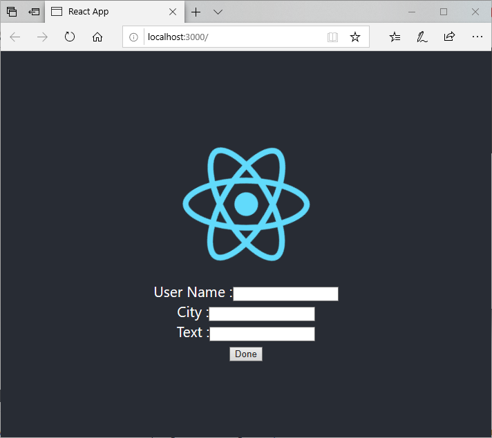

# Spring-Boot-React

Source version control : Git
Build tool : Maven (for Spring Boot) and npm (react-scripts for React)
Application server : Tomcat
Unit test framework : JUnit (for Spring Boot)

My services are available on both web (Chrome, Internet Explorer, Firefox, and Safari) and mobile.

**Prerequisites:** Java 8, Node.js and MySQL

## Getting Started

To install this application, run the following commands:

```bash
git clone https://github.com/EuihoonSeol/Spring-Boot-React.git
cd Spring-Boot-React
```

Before running the server, cd into `server\src\main\resources` folder and update the following lines on `application.properties` files with your MySQL instance and login credentials

```bash
spring.datasource.url=jdbc:mysql://localhost:3306/loyaltyone
spring.datasource.username=root
spring.datasource.password=abc1234
```

This will get a copy of the project installed locally. To install all of its dependencies and start each app, follow the instructions below.

To run the server, cd into the `server` folder and run:
 
```bash
./mvnw spring-boot:run
```

To run the client, cd into the `client` folder and run:
 
```bash
npm start
```

This will open a web browser on your desktop, and it should display something like this:



The primary application is in the master branch. To check out the master branch on your local machine, run the following command.

```bash
git checkout master
```
